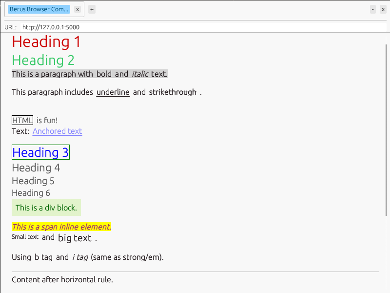
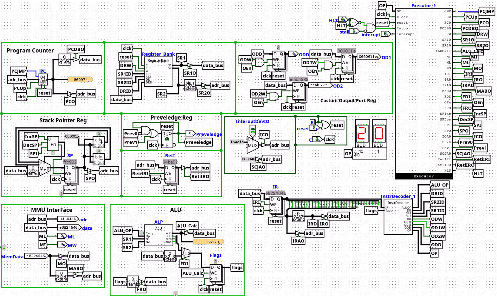
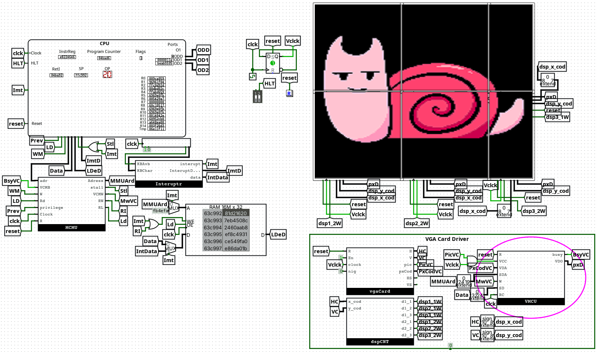

# Soham Tilekar | Systems Engineer

Building Systems from Scratch: Compilers, CPUs, Browsers & OS

---

## 👤 About Me
Self-taught systems developer with a passion for building foundational technology from the ground up. Coding since age 15, focusing on deep technical challenges including custom compiler backends, hardware architecture, and kernel development.

- **Education:** B.Tech in Computer Science Engineering (Aug 2024 - July 2028) at Pimpri Chinchwad University, Pune District, Maharashtra, India. (Current: 3rd Semester)

### Professional Focus
*   Systems Programming
*   Compiler Design and LLVM backend work
*   CPU architecture and emulator toolchains
*   Kernel-level operating system development

### Current Direction
*   High-performance language tooling
*   Hardware-software co-design experiments
*   Agentic AI workflows and research automation
*   Open-source system libraries and developer tooling

---

## 🛠️ Technical Arsenal

### Languages
*   Rust (Expert)
*   C++ / C (Expert)
*   Python (Expert)
*   Go (Proficient)
*   JavaScript (Proficient)
*   Assembly (x86/Custom)

---

## 🚀 Featured Engineering

### 1. GigglyCode
*A compiled systems language designed to bridge performance and flexibility, featuring recursive-descent parsing and robust type inference.*

*   **Tech Stack:** C++ / LLVM 17+
*   **Key Features:**
    *   **Bridge Mechanism:** Seamlessly embed Python and C code directly within the source.
    *   **Ownership Model:** Custom type system and ownership rules to prevent memory leaks.
    *   **Advanced Features:** Generic structs, function overloading via name mangling, and modules.
*   **Technical Deep Dive:** Implements a full front-end (Lexer/Parser/Sema) and utilizes LLVM optimization passes to ensure native binaries are competitive with C++.
*   **Source:** [GitHub](https://github.com/SohamTilekar/GigglyCode)

### 2. TilekarOS
*A monolithic 32-bit x86 operating system built from scratch to explore kernel-level resource management.*

*   **Status:** CLI-first experience with VGA TTY and keyboard-driven workflow.
*   **Asset Preview:** 
*   **Tech Stack:** C / x86 ASM
*   **Key Features:**
    *   **Memory Mgmt:** Physical (Bitmap) and Virtual (Paging) management with a higher-half kernel.
    *   **VFS Stack:** Unified file access with FAT12 support and sector-level caching.
    *   **Real-time Sync:** Python orchestrator to sync host files to the OS disk image during dev.
*   **Technical Deep Dive:** Features a preemptive round-robin scheduler, ELF32 loading, and a robust syscall API (int 0x80) for userspace processes.
*   **Source:** [GitHub](https://github.com/SohamTilekar/TilekarOS)

### 3. Berus Browser
*A lightweight, from-scratch browser engine implemented without WebKit, Blink, or Gecko.*

*   **Asset Preview:** 
*   **Tech Stack:** Rust
*   **Key Features:**
    *   **Custom Parsers:** Stateful HTML-to-DOM and CSS rule-set tokenizers built in Rust.
    *   **Layout Engine:** Handles CSS specificity, cascade, and complex text wrapping logic.
    *   **Multimedia:** Integrated audio playback using the rodio library for `<audio>` tags.
*   **Technical Deep Dive:** Uses the egui framework for rendering the layout tree. Implements hand-coded logic for border-radius and block element positioning.
*   **Source:** [GitHub](https://github.com/SohamTilekar/berus)

### 4. SS32 Architecture
*A complete 32-bit computer system designed from the gate level up to the software toolchain.*

*   **Assets:**
    *   
    *   
*   **Tech Stack:** Rust / Logisim
*   **Key Features:**
    *   **ISA & Hardware Design:** 32-bit ISA with GPRs, stack operations, and interrupt handling designed in Logisim.
    *   **Rust Toolchain:** Cycle-accurate emulator with a built-in debugger and memory visualizer.
    *   **Custom Assembler:** Translates mnemonics into binary for the SS32 architecture.
*   **Components:** PC (Program Counter), MMU, ALU, CU (Control Unit), REG (Register Bank), RAM, BUS, VGA, INT (Interrupts).
*   **Source:** [GitHub](https://github.com/SohamTilekar/SS32)

### 5. Friday v2
*A high-autonomy agentic assistant built for deep research, tool use, and system-level execution loops.*

*   **Tech Stack:** Python / Agentic AI
*   **Key Features:**
    *   **Deep Research Loop:** Uses Firecrawl to build hierarchical knowledge trees from the web.
    *   **Computer Access:** Local sandboxed terminal for file management and code execution.
    *   **Branching History:** Supports non-linear chat paths, allowing users to "rewind" and explore.
    *   **Multi-modal:** Integrated with Gemini 1.5 Pro and Imagen for analysis and generation.
*   **Source:** [GitHub](https://github.com/SohamTilekar/fridayv2)

### 6. VidioPy
*A programmatic video editing toolkit with timeline automation and dynamic composition APIs.*

*   **Tech Stack:** Python / FFmpeg
*   **Key Features:**
    *   **FFmpeg Wrapper:** Clean object-style API over complex filtergraphs.
    *   **Dynamic Coordinates:** Time-based lambda positioning for animation.
    *   **PyPI Release:** Packaged for production use with dependency management.
*   **Source:** [GitHub](https://github.com/SohamTilekar/vidiopy)

---

## 📞 Get In Touch
I am always looking for opportunities to apply systems-level expertise to real-world challenges in compilers, kernel engineering, architecture design, and AI-integrated developer systems.

- **Email:** [sohamtilekar233@gmail.com](mailto:sohamtilekar233@gmail.com)
- **GitHub:** [GitHub.com/SohamTilekar](https://github.com/SohamTilekar)
- **LinkedIn:** [LinkedIn.com/in/soham-tilekar](https://www.linkedin.com/in/soham-tilekar)

---
*Built with ❤️ by Soham Tilekar • 2026*
